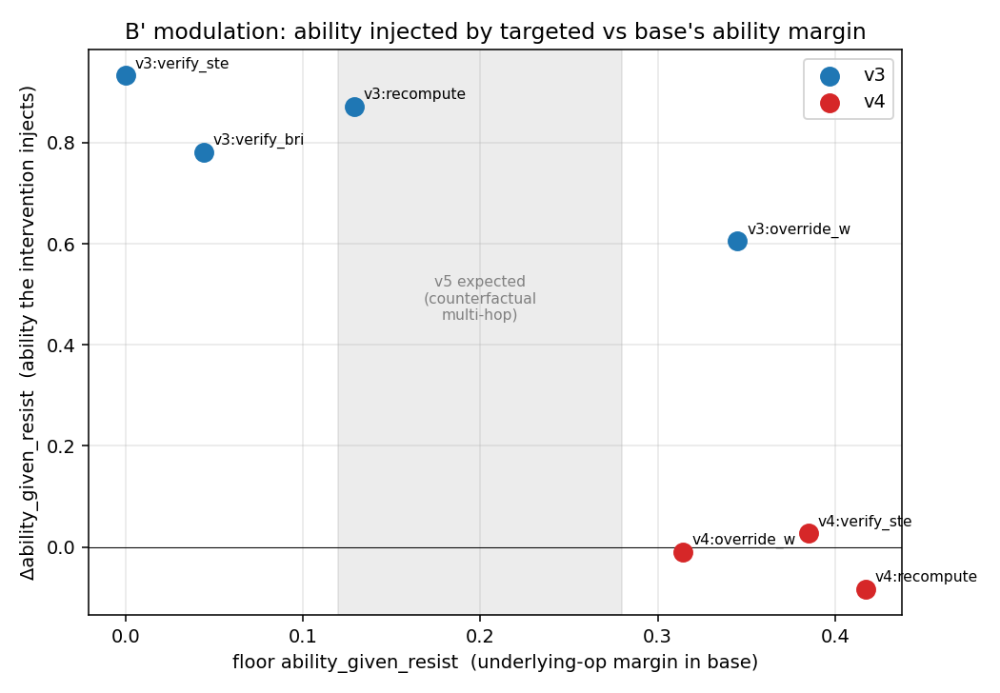

# B' audit (PHASE 0) — three-layer re-scoring of existing v3 + v4 predictions

_No retraining; only re-scoring of historical predict_outputs. All `ability_given_resist` carry n_resist and are NOT horizontally comparable across runs (denominator = resisted subset; v4 §6.1 lesson)._

## v3: three-layer table (floor = scaffold_only)

| cell | run | committed | resist_wrong | ability\|resist (n) | final_acc |
|---|---|---|---|---|---|
| override_wrong_claim | floor | 0.98 | 0.93 | 0.34 (n=55) | 0.32 |
| override_wrong_claim | targeted_override_wrong_claim | 1.00 | 1.00 | 0.95 (n=60) | 0.95 |
| override_wrong_claim | full | 1.00 | 0.72 | 1.00 (n=43) | 0.72 |
| verify_bridge | floor | 1.00 | 0.75 | 0.04 (n=45) | 0.03 |
| verify_bridge | targeted_verify_bridge | 1.00 | 0.95 | 0.82 (n=57) | 0.78 |
| verify_bridge | full | 1.00 | 0.47 | 0.96 (n=28) | 0.45 |
| verify_step | floor | 1.00 | 1.00 | 0.00 (n=60) | 0.00 |
| verify_step | targeted_verify_step | 1.00 | 1.00 | 0.93 (n=60) | 0.93 |
| verify_step | full | 1.00 | 1.00 | 1.00 (n=60) | 1.00 |
| recompute | floor | 1.00 | 0.99 | 0.13 (n=178) | 0.13 |
| recompute | targeted_recompute | 1.00 | 1.00 | 1.00 (n=180) | 1.00 |
| recompute | full | 1.00 | 0.98 | 1.00 (n=177) | 0.98 |

## v4: three-layer table (floor = scaffold_conv)

| cell | run | committed | resist_wrong | ability\|resist (n) | final_acc |
|---|---|---|---|---|---|
| verify_step | floor | 1.00 | 0.97 | 0.39 (n=78) | 0.38 |
| verify_step | targeted_verify_step | 1.00 | 1.00 | 0.41 (n=80) | 0.41 |
| verify_step | full | 1.00 | 1.00 | 0.57 (n=80) | 0.57 |
| override_wrong_claim | floor | 1.00 | 0.64 | 0.31 (n=51) | 0.20 |
| override_wrong_claim | targeted_override_wrong_claim | 1.00 | 0.99 | 0.30 (n=79) | 0.30 |
| override_wrong_claim | full | 1.00 | 0.60 | 0.42 (n=48) | 0.25 |
| recompute | floor | 1.00 | 0.60 | 0.42 (n=48) | 0.25 |
| recompute | targeted_recompute | 1.00 | 0.97 | 0.33 (n=78) | 0.33 |
| recompute | full | 1.00 | 0.57 | 0.46 (n=46) | 0.26 |

## 0.3 Modulation curve — does targeted INJECT ability, vs the underlying-op margin

x = floor ability_given_resist (how much base already does the underlying op). Primary y = **Δability_given_resist** (targeted − floor): how much ability the intervention itself injects. Secondary y = conversion = Δfinal/Δresist (user-defined; **denominator collapses in v3** where floor already resists, so it is unstable there).

| domain | cell | x = floor ability | Δresist | Δability (primary y) | Δfinal | conversion | note |
|---|---|---|---|---|---|---|---|
| v3 | override_wrong_claim | 0.34 | +0.07 | **+0.60** | +0.63 | +9.31 |  |
| v3 | verify_bridge | 0.04 | +0.20 | **+0.78** | +0.75 | +3.75 |  |
| v3 | verify_step | 0.00 | +0.00 | **+0.93** | +0.93 | n/a | conv denom small (dr=+0.00) |
| v3 | recompute | 0.13 | +0.01 | **+0.87** | +0.87 | n/a | conv denom small (dr=+0.01) |
| v4 | verify_step | 0.39 | +0.03 | **+0.03** | +0.04 | n/a | conv denom small (dr=+0.03) |
| v4 | override_wrong_claim | 0.31 | +0.35 | **-0.01** | +0.10 | +0.28 |  |
| v4 | recompute | 0.42 | +0.38 | **-0.08** | +0.07 | +0.20 |  |

_Reading: low margin (v3, x≈0) ⇒ targeted INJECTS ability (Δability≈+0.6..+0.9) ⇒ final rises a lot. High margin (v4, x≈0.3-0.4) ⇒ targeted cannot inject ability (Δability≈0) ⇒ only the decision is induced and final is capped. The negative Δability-vs-margin relation IS the modulation law._

## 0.4 Interference budget — single-operator vs mixed (drift)

In-domain keep_answer accuracy (lower = more over-repair drift):

| domain | floor | full(mixed) | tgt_verify_s | tgt_override | tgt_recomput |
|---|---|---|---|---|---|
| v4 | 0.76 | 0.83 | 0.45 | 0.46 | 0.35 |
| v3 | 0.22 | 0.99 | 0.35 | 0.44 | 0.82 |

Out-of-domain (v4 transfer, un-perturbed GSM): no-answer drift base 8% (23/300), mixed full 17% (50/300), single verify_step 30% (91/300). Only 2 anchored-vs-unanchored points => qualitative rule only: a balanced keep/abstain anchor dose (present in mixed/scaffold, absent in single-op) roughly halves out-of-domain drift (30%->17%). Not enough points to fit a curve.

## 0.5 minimal probe (Δlog p) feasibility

forward-only probing script(s) located locally: ['/Users/bytedance/Downloads/probing/probe.py', '/Users/bytedance/Downloads/probing/run_first_pass_probing.py']. Base/inject checkpoints live on the server (`/mnt/hdfs/xwqu/...`), NOT local, so Δlog p cannot be computed here. Verdict: **needs PHASE 1 (run on server)** to bridge the original forward-only diagnostic to the training framework; not blocking for the B' skeleton, which stands on the re-scored three layers above.

## 0.6 B' skeleton self-assessment

**attribution layer** — CLEANLY supported by existing data. floor level in each cell is the diagnostic signal; targeted direction vs floor is the intervention result; the two agree (low-margin cells improve a lot, high-margin cells barely move).

**decision layer** — CLEANLY supported (re-scored from existing predictions, v3 and v4 column-aligned). targeted induces resist_wrong in both domains (v4 override 0.64→0.99, recompute 0.60→0.97; v3 verify_bridge 0.75→0.95). Generic, not operator-selective.

**ability layer** — supported but with the §6.1 caveat (n_resist differs across runs, not horizontally comparable). The KEY contrast is clean directionally: targeted INJECTS ability where the base lacks it (v3 Δability +0.6..+0.9) and CANNOT where the base has it (v4 Δability ≈ 0).

**modulation curve** — two well-separated regimes (v3 margin≈0 / v4 margin≈0.3-0.4) with the predicted negative relation. It is currently a TWO-REGIME CONTRAST, not a continuous curve; the user-defined conversion metric is unusable in v3 (denominator collapse), so Δability is the reported axis.

### Can B' stand as a complete paper WITHOUT v5?
**Yes, as a two-regime causal-attribution result**: *repair/operator-induction induces a generic repair DECISION; whether that decision converts to benchmark gain is gated by the base's underlying-ability margin — full conversion when the ability is absent (synthetic, v3), capped when present (real arithmetic, v4).* The three layers + interference budget support this from existing data alone.
**What v5 adds (not survival, but strength)**: a MIDDLE margin point turns the two-regime contrast into a monotone modulation curve, pre-empting a reviewer's 'two points are not a curve' objection. Recommend v5 as reinforcement, not as a gate.

