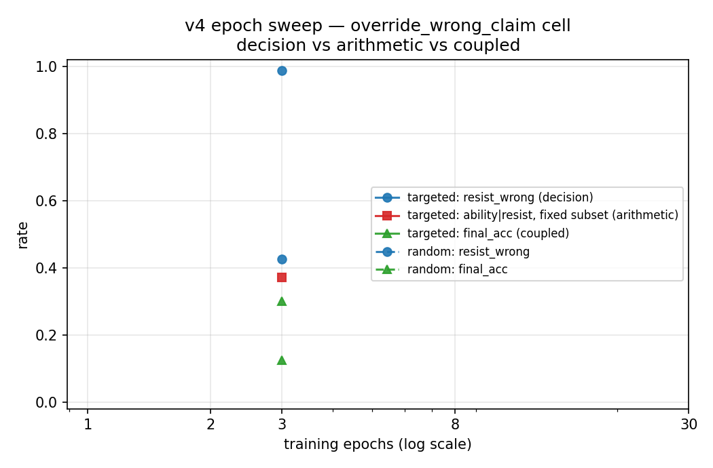

# v4 epoch sweep — extrapolability of the decision-vs-ability split

Epoch is the only variable (full-param SFT, seed 42, all else == round-1 v4). Each ckpt decoded on v4_actionized_eval (480). `ability|resist fixed` = final==gold on a FIXED subset S = items RESISTED by every ckpt on that cell (decision held successful for all -> pure arithmetic, constant denominator; the §6.1 denominator-bias fix).

## Per-branch, per-epoch (branch's OWN cell)

| branch | epoch | cell | parse | resist_wrong | ability\|resist fixed (n) | final_acc |
|---|---|---|---|---|---|---|
| random_override_wrong_claim | 3 | override_wrong_claim | 1.0 | **0.425** | 0.3333 (27) | 0.125 |
| scaffold_conv | 30 | override_wrong_claim | 1.0 | **0.6375** | 0.3333 (27) | 0.2 |
| targeted_override_wrong_claim | 3 | override_wrong_claim | 1.0 | **0.9875** | 0.3704 (27) | 0.3 |
| targeted_recompute | 3 | recompute | 1.0 | **0.975** | 0.3333 (78) | 0.325 |
| targeted_verify_step | 3 | verify_step | 1.0 | **1.0** | 0.4125 (80) | 0.4125 |

## Conclusion (fill from the curve)

- decision (resist_wrong) appears at epoch: __
- ability_fixed across epochs: __ (expected ~flat ≈ base arithmetic ceiling)
- overfit / non-extrapolable region begins at epoch: __
- targeted vs random at low epoch (1–2): __ (specificity present? or only at high epoch?)

## Extrapolability statement

_Based on the curve: which conclusions hold at low epoch (extrapolate to near-single-pass real training) vs which are convergent-setting artifacts (controlled diagnosis only)._
